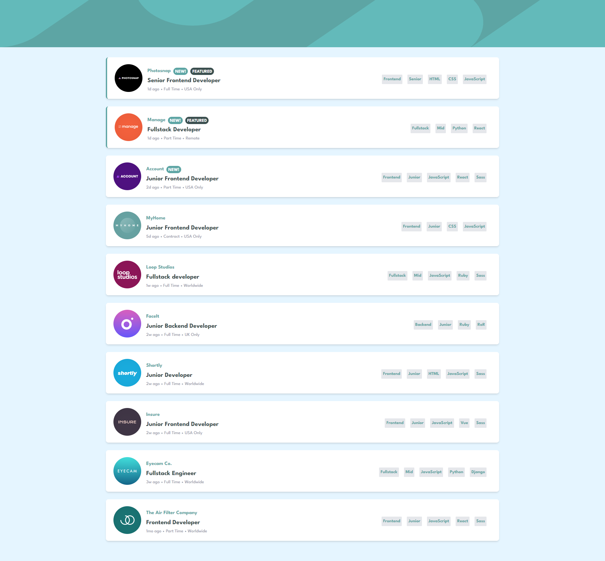

# Frontend Mentor - Job listings with filtering solution

This is a solution to the [Job listings with filtering challenge on Frontend Mentor](https://www.frontendmentor.io/challenges/job-listings-with-filtering-ivstIPCt). Frontend Mentor challenges help you improve your coding skills by building realistic projects.

## Table of contents

- [Overview](#overview)
  - [The challenge](#the-challenge)
  - [Screenshot](#screenshot)
  - [Links](#links)
- [My process](#my-process)
  - [Built with](#built-with)
  - [What I learned](#what-i-learned)
  - [Continued development](#continued-development)
- [Author](#author)

**Note: Delete this note and update the table of contents based on what sections you keep.**

## Overview

### The challenge

Users should be able to:

Challenges from creators:

- View the optimal layout for the site depending on their device's screen size
- See hover states for all interactive elements on the page
- Filter job listings based on the categories

I also added several features by myself:

- I added sorting of job elements, if in the json file another job offer would get the status "featured" and, or "new" it will be sorted so that it is generated first. This is not done "rigidly"
- I took care of errorhandling, used modern methods such as generating a spinner when data is fetchowanee
- Using modern libraries, I added subtle animations on individual components to make the whole application behave more "smoothly."

### Screenshot

### Links

- Solution URL: [Add solution URL here](https://your-solution-url.com)
- Live Site URL: [Add live site URL here](https://your-live-site-url.com)

## My process

### Built with

- [React](https://reactjs.org/) - JS library
- [React Query](https://react-query-v3.tanstack.com/) - React framework
- [Framer Motion](https://www.framer.com/motion/) - React library for animations
- [Tailwindcss](https://tailwindcss.com/) - Tailwindcss

### What I learned

In the project I practiced I learned among other things :

- Planning the application based on breaking it down into individual components. Before coding, I tried to think about how the individual components should work, etc. I did this using an application available at https://app.diagrams.net/
- Creating dynamic elements on a page based on a .json file
- Sending and accessing relevant props through the different components
- working with several states simultaneously
- code refactoring
- using modern libraries such as tailwindcss, react query or framer motion
- dealing with error handling
- using many different functions on arrays, objects in order to implement proper filtering

### Continued development

In future projects I want to further learn how to use modern react, how to wisely manage the data that flows through the various components. To try to apply further learned hookups, such as for example useContext, etc. I would also like to learn how to work with REDUX, but for the moment I would like to learn the basics of React Query. I will probably also want to come back to this project, because I really liked the idea of the app itself, and I see here a lot of things that can be added to make the app grow

## Author

- Github - [DawidBugajski](https://github.com/DawidBugajski)
- Frontend Mentor - [DawidBugajski](https://www.linkedin.com/in/dawid-bugajski-1bb01519b/)
